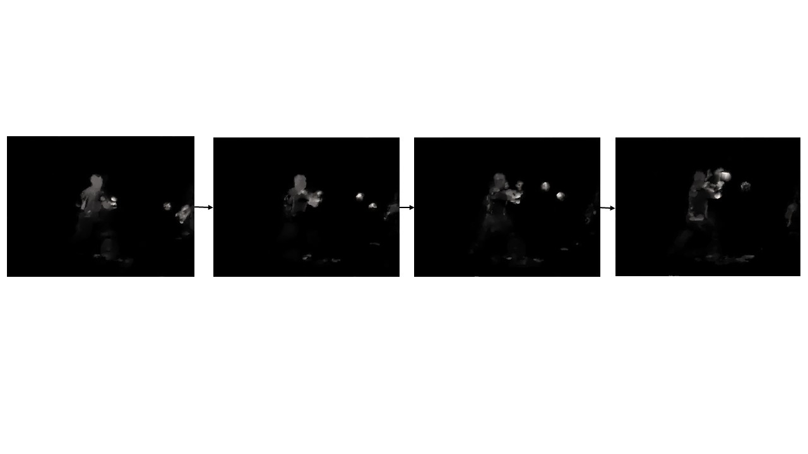

## TVL1_Optical_Flow_FrameGeneration
Generating optical flow frame by using TVL1 algorithm in organized way is not so difficult.But for a newbie it is toilsome to find this easier task.TVL1 is most popular way to generate optical flow frame which outperforms most other algorithm but lacks processing speed.


## Folder Directory Hierarchy

Parent_folder

|

+ sub_folder1

|

+ sub_folder2

|

...


## Demo of the Optical Flow Frame 

Some optical flow frame of the video contains in this repo


Here is the resultant frame of flow.We can get the horizontal component(means u component) and vertical component(means v component) from the given code which is more significant in terms of analytical task.

## Getting Started
1. Clone this repository

2. Install dependencies
 ```bash
   conda install -c anaconda opencv
   or
   pip install opencv-contrib-python 
 ```
3. Run the 'opticalflow.py' from command window
 ```bash
   python opticalflow.py
   ```

N.B : By default it will run on TVL1 algortihm.To generate optical flow frame on Farneback algorithm you can clear the comment and run the line of 93 ( flow = cv2.calcOpticalFlowFarneback(prvs,next, None, 0.8, 3, 10, 3, 7, 1.1, 0)
) instead of ( flow = optical_flow.calc(prvs, next, None) )

To know about all other algortihms and parameters of optical flow go through documentation of opencv [All Optical Flow Process in Opencv](https://docs.opencv.org/3.4/dc/d6b/group__video__track.html#ga5d10ebbd59fe09c5f650289ec0ece5af)
